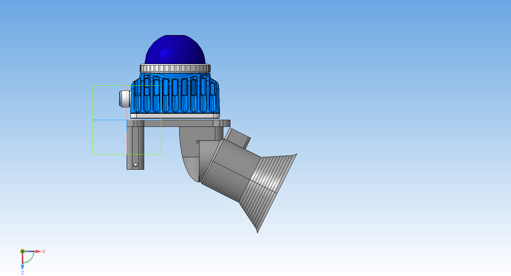
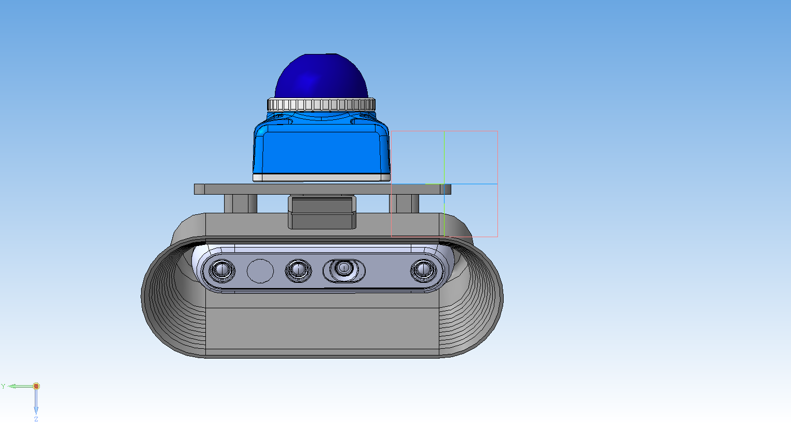
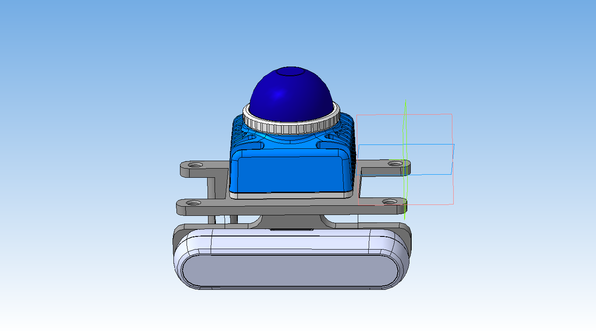
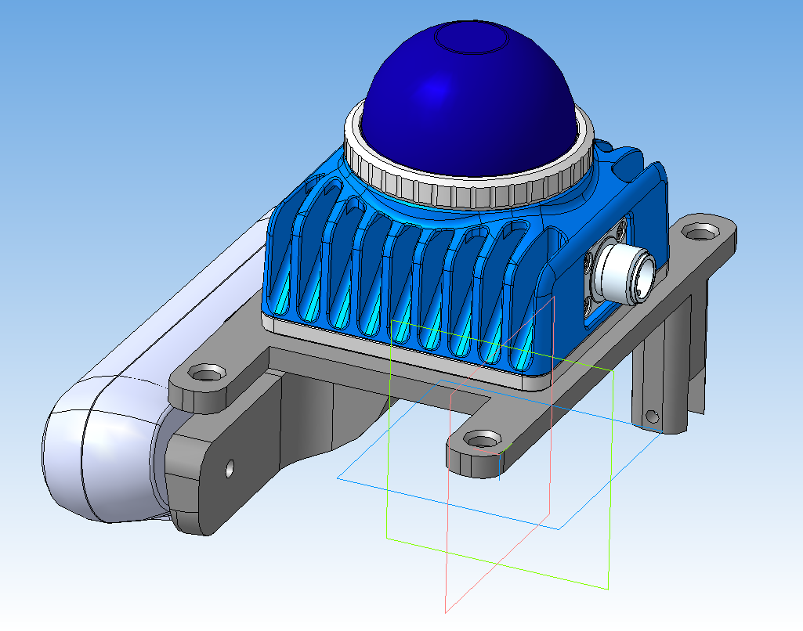

# Lidar-Camera Calibration Tool

Интерактивный инструмент для калибровки лидара **Livox Mid360** и RGB-D камеры **RealSense** в ручную (при малом наложении облаков точек).


В репозитории `mounts/` содержатся 2 готовых .stl крепления камеры и лидара, для которых в программе имеются готовые пресеты.









## Возможности

- 📷 Захват облаков точек с лидара и камеры
- 🎯 Визуализация двух облаков в одном окне
- ✋ Ручная подгонка матрицы вращения и вектора трансляции через ImGui
- 📦 Отсечение облаков по 6 плоскостям (bounding box)
- 💾 Сохранение/загрузка облаков в бинарном формате
- 🔄 Выбор предустановленных креплений
- 🤖 Экспериментальная автоматическая калибровка (ICP / GICP)

## Требования

- Ubuntu 20.04+ (протестировано на 20.04)
- Qt 5.12+ (Core, Gui, Widgets, OpenGL)
- Eigen3: `sudo apt install libeigen3-dev`
- Intel RealSense SDK
- Livox SDK2
- OpenMP: `sudo apt install libomp-dev`
- small_gicp (включена в репозиторий)

## Сборка

```bash
mkdir build && cd build
qmake ../CalibrationTools.pro
make -j$(nproc)
